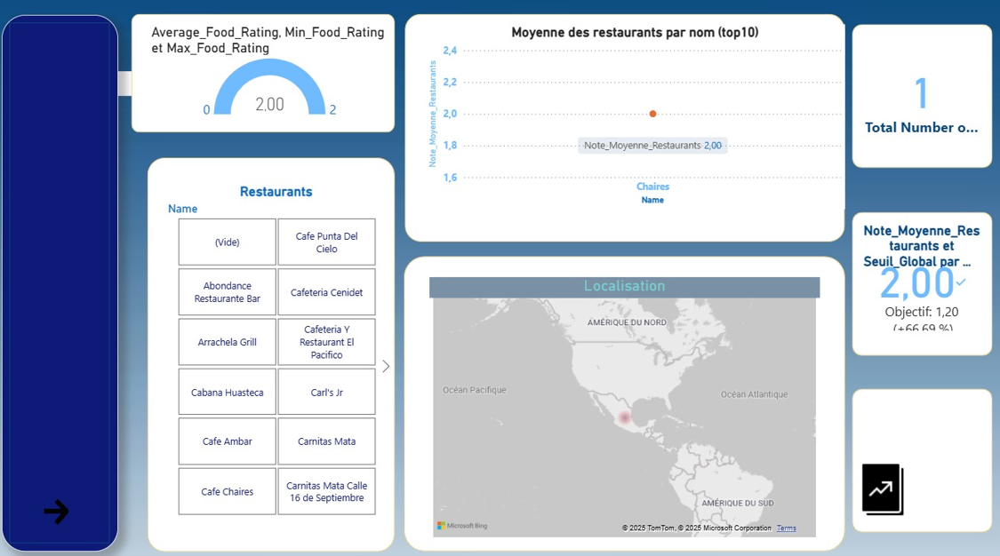
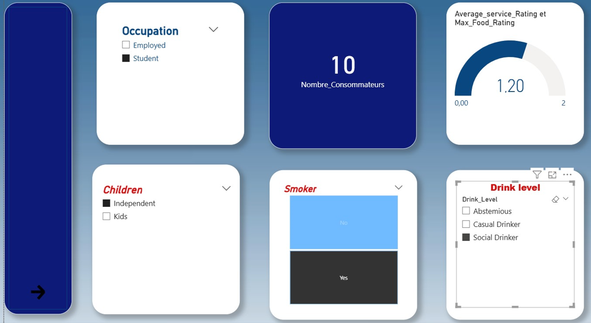
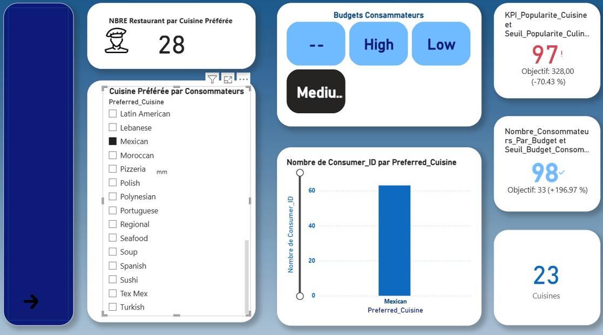

# 📊 Restaurant Ratings – Business Intelligence Project
Analyse & Visualisation des comportements consommateurs et performances restaurants

## 📌 1. Description du projet
Ce projet BI vise à analyser :
- Les habitudes des consommateurs (budget, âge, occupation, enfants, tabac/alcool…).
- Le niveau de satisfaction gastronomique (ratings nourriture & service).
- La performance des restaurants (type de cuisine, notes moyennes, localisation).
- Les tendances de popularité culinaires selon les profils consommateurs.

Le projet utilise :
✔ Des fichiers CSV (données consommateurs, restaurants, notes, préférences)  
✔ Un Notebook d’exploration : **Food-Data.ipynb**  
✔ Un rapport interactif Power BI : **BIFinal.pbix**  
✔ Un dictionnaire des données : **data_dictionary.csv**

---

## 📁 2. Structure du projet
```
📦 Restaurant_Ratings
 ┣ 📂 Data Dictionary
 ┃ ┗ 📄 data_dictionary.csv
 ┣ 📂 Dataset
 ┃ ┣ consumer_preferences.csv
 ┃ ┣ consumers.csv
 ┃ ┣ ratings.csv
 ┃ ┣ restaurant_cuisines.csv
 ┃ ┗ restaurants.csv
 ┣ 📄 Food-Data.ipynb
 ┣ 📄 BIFinal.pbix
 ┗ 📄 README.md
```

---

## 📚 3. Dictionnaire des données (extrait automatique)
✔ Fichier complet : **data_dictionary.csv**

### **Consumers**
| Champ | Description |
|-------|-------------|
| Consumer_ID | Identifiant unique |
| City / State / Country | Localisation |
| Smoker | Oui/Non |
| Drink_Level | Abstemious / Casual / Social |
| Marital_Status | Célibataire / Marié |
| Children | Kids / Independent |
| Occupation | Étudiant / Employé / Chômeur |
| Budget | Low / Medium / High |
| … | Voir fichier complet |

### **Restaurants**
| Champ | Description |
|-------|-------------|
| Restaurant_ID | ID unique |
| Name | Nom du restaurant |
| Latitude / Longitude | Géolocalisation |
| Alcohol_Service | Aucun / Vin & Bière / Full Bar |
| Smoking_Allowed | Oui/Non |
| Price | Low / Medium / High |
| Area | Open / Closed |
| Parking | None / Public / Valet |

### **Ratings**
| Note | Signification |
|------|--------------|
| 0 | Unsatisfactory |
| 1 | Satisfactory |
| 2 | Highly Satisfactory |

---

## 🧪 4. Data Exploration – *Food-Data.ipynb*
Le notebook comprend :

### ✔ Analyses exploratoires
- Distribution des âges  
- Répartition des budgets  
- Popularité des cuisines  
- Analyse géographique des restaurants  
- Corrélations :  
  - Satisfaction vs Budget  
  - Satisfaction vs Type de boisson  
  - Satisfaction vs Service  

---
## 📊 5. Transformation & préparation des données (ETL Power Query)
- Modification des types de colonnes
- Suppression des doublons
- Promotion des en-têtes
- Ajout d’index
- Fusion des requêtes (join entre tables)
- Développement des colonnes (expanding)
- Suppression et permutation de colonnes
- Renommage des champs
- Structuration finale pour Power BI

## 📊 6. Rapport Power BI – *BIFinal.pbix*
Le rapport contient **trois pages principales** :

### 📍 **Page 1 – Analyse Restaurants**
Composants :
- KPI : Average_Food_Rating, Min_Food_Rating, Max_Food_Rating  
- Top 10 restaurants par note moyenne  
- Carte géographique  
- Liste interactive  
- KPI global : Total Restaurants  
- KPI objectif : Note Moyenne vs Objectif  

### 📍 **Page 2 – Analyse Consommateurs**
Composants :
- Segmentations : Occupation, Drink Level, Smoker, Children  
- KPI : Nombre total de consommateurs  
- Jauge : Service Rating moyen  
- Analyse comportementale  

### 📍 **Page 3 – Préférences Culinaires**
Composants :
- KPI : Nombre de restaurants par cuisine  
- Segmentation : Preferred Cuisine  
- Bar Chart : Nombre de consommateurs par cuisine préférée  
- KPI Popularité Cuisine vs Objectif  
- Budgets : Low / Medium / High  

---

## 📌 6. KPIs développés
| KPI | Description |
|-----|-------------|
| Average_Food_Rating | Satisfaction moyenne des plats |
| Average_Service_Rating | Satisfaction moyenne du service |
| Total_Restaurants | Nombre total de restaurants |
| Total_Consumers | Nombre total de consommateurs |
| Popularité cuisine | Nombre de consommateurs / Objectif |
| Restaurants par cuisine | Diversité & offre gastronomique |
| Budget consommateur | Segmentation High/Medium/Low |

---

## 🛠 7. Technologies utilisées
- Python (Pandas, Seaborn, Matplotlib)
- Power BI (DAX, visualisations avancées)
- Jupyter Notebook pour l’exploration

---

## ▶️ 8. Installation & exécution
### 1. Cloner le dépôt
```
git clone https://github.com/.../Restaurant_Ratings.git
```

### 2. Lancer l’exploration
```
jupyter notebook Food-Data.ipynb
```

### 3. Ouvrir le Dashboard
Ouvrir **BIFinal.pbix** via *Power BI Desktop*.

---

## 🧩 9. Améliorations futures
- Intégration API restaurants (Yelp, Google Maps)  
- Machine Learning : prédiction de satisfaction  
- Dashboard temps réel (Kafka + Power BI)  
- Site web interactif (Flask / Streamlit)  

---

## ❤️ 10. Auteur
**Hamza Nasr**  
